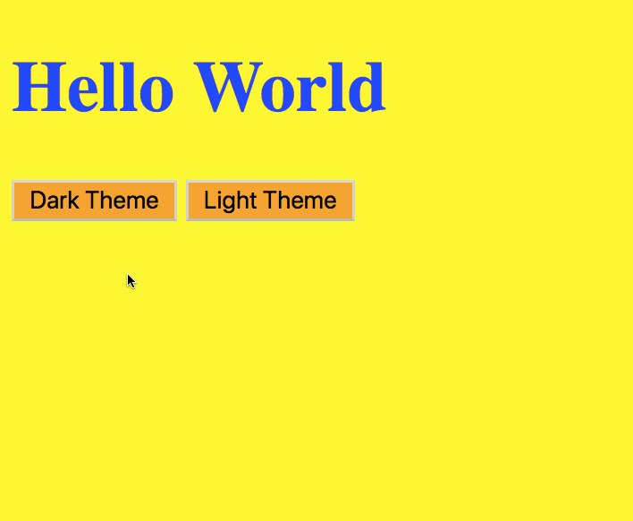

# Tech Karo - June 11, 2019

## In-Class

We used [querySelector()](https://www.w3schools.com/jsref/met_document_queryselector.asp) to create a Dark / Light theme selector app.



In this project, we used the following new concepts
- [if / else statements](https://www.w3schools.com/js/js_if_else.asp) (اگر / ورنہ)
- [JS Dates](https://www.w3schools.com/js/js_dates.asp) to change theme depending on the time of the day
```
new Date().getHours()
```
- [JS Operators](https://www.w3schools.com/js/js_operators.asp)
  - `>`  (Greater than)
  - `>=` (Greater than or equal to)
  - `&&` (And)
  - `=`  (Assignment)
  
  https://github.com/sarahsga/tk19-class-resources/blob/d0a249463ec7e56444ee2dfc040495fcee34e745/2019-06-11/script.js#L4
  
---

## Resources
- **A Smarter Way to Learn JS** *by Mark Mayers*
- Study [JS from w3Schools](https://www.w3schools.com/js/default.asp).
